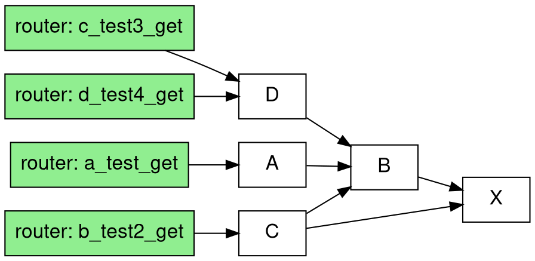

# fastapi-router-viz

show routes and schemas relationships

> This repo is still in early stage.

```python
from fastapi_router_viz.graph import Analytics
from pydantic import BaseModel
from fastapi import FastAPI
from typing import Optional


def test_analysis():

    class X(BaseModel):
        id: int

    class B(BaseModel):
        id: int
        value: str
        x: X

    class A(BaseModel):
        id: int
        name: str
        b: B

    class C(BaseModel):
        id: int
        name: str
        b: B
        x: X

    class D(BaseModel):
        id: int
        name: str
        b: B

    app = FastAPI()

    @app.get("/test", response_model=Optional[A])
    def a():
        return None

    @app.get("/test2", response_model=Optional[C])
    def b():
        return None

    @app.get("/test3", response_model=Optional[D])
    def c():
        return None

    @app.get("/test4", response_model=Optional[D])
    def d():
        return None

    analytics = Analytics()
    analytics.analysis(app)
    print(analytics.generate_dot())


if __name__ == "__main__":
    test_analysis()
```

generate the dot description



then you'll see the internal dependencies


